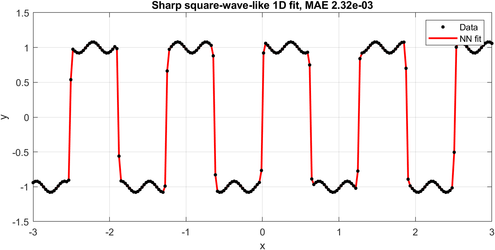

# Neural Net Curve Fitting and Surface Fitting Toolbox

[](https://www.mathworks.com/products/matlab.html)
[](#installation)
[](LICENSE)

A lightweight MATLAB toolbox for **N-dimensional curve fitting**, **surface fitting**, **nonlinear regression**, and **function approximation**. It combines learnable B-spline activations with quasi-Newton refinement to achieve high accuracy on sharp or nonsmooth targets without requiring the Deep Learning Toolbox or any external dependencies.

```matlab
NN = NeuralFit(x, y, [N, M]);
yHat = NN.Evaluate(x);
```

<p align="center">
  
</p>

<p align="center">
  
</p>

---

## Usage

- `x`: input data, `N × D` (dimensions × samples)
- `y`: target data, `M × D`
- `[N, M]`: input and output dimensions

The default activation is a **learnable quadratic B-spline**. To switch:

```matlab
NN = NeuralFit(x, y, [N, M]);                       % learnable B-spline (default)
NN = NeuralFit(x, y, [N, M], 'basis', 'Gaussian');   % fixed Gaussian basis
NN = NeuralFit(x, y, [N, M], 'basis', 'Wavelet');    % fixed Wavelet basis
```

---

## Features

- **Learnable B-spline activation** — piecewise polynomial basis that adapts shape during training; ideal for sharp, oscillatory, or nonsmooth data
- **7 built-in activations** — Gaussian, Sigmoid, tanh, ReLU, Wavelet, Sine, BSpline; plus custom function-handle support
- **ANN and ResNet** architectures with arbitrary layer widths
- **7 optimizers** — SGD, SGDM, RMSprop, ADAM, AdamW, BFGS, L-BFGS
- **Two-stage training** — stochastic first stage + quasi-Newton refinement for machine-precision results
- **Autoscaling** — automatic input normalization for stable convergence
- **Multi-input, multi-output** — arbitrary `N → M` mappings
- **Zero dependencies** — pure MATLAB, no toolboxes, no MEX

---

## Example: 2D Surface Fitting

```matlab
x = linspace(-2, 2, 20);
y = x;
[X, Y] = meshgrid(x, y);
U = X.^2 + Y.^2;
Z = exp(-0.5*U).*cos(2*U);

data  = [X(:), Y(:)].';
label = Z(:).';

NN = NeuralFit(data, label, [2, 1]);
prediction = NN.Evaluate(data);

figure;
surf(X, Y, Z); hold on;
scatter3(data(1,:), data(2,:), prediction);
title('2D Surface Fitting');
```

---

## Installation

Download and extract the package, then run:

```matlab
run('installScript/installNeuralNetsPack.m')
```

This permanently adds the toolbox to the MATLAB path. After installation, `NeuralFit`, `Initialization`, and `OptimizationSolver` are accessible from any folder.

For a session-only setup without saving the path:

```matlab
addpath('installScript')
setupNeuralNetPath(struct('savePath', false))
```

---

## Full Customizable Workflow

For direct control over architecture, activation, and solver:

```matlab
data  = linspace(0, 2*pi, 1000);
label = data.*sin(data) + cos(3*data);

NN.Cost = 'MSE';
NN.ActivationFunction = 'Gaussian';
NN = Initialization([1, 7, 7, 7, 1], NN);

option.Solver = 'ADAM';
option.MaxIteration = 200;
option.BatchSize = 100;
NN = OptimizationSolver(data, label, NN, option);

option.Solver = 'BFGS';
option.MaxIteration = 400;
NN = OptimizationSolver(data, label, NN, option);

prediction = NN.Evaluate(data);
```

See [docs/Customization.md](docs/Customization.md) for a full reference on activation functions, layer structure, network types, optimizer options, preprocessing, and cost functions.

---

## Demo Scripts

Ready-to-run templates in `demoScript/`:

| Script | Description |
|--------|-------------|
| `SimplifiedWorkflow.m` | Minimal nonlinear regression workflow |
| `CustomizableWorkflow.m` | Full architecture and solver control |
| `BenchmarkActivation1D.m` | B-spline vs. fixed Gaussian activation comparison |
| `SpiralClassification.m` | 2D classification example |
| `WeightedLeastSquares.m` | Weighted fitting example |

---

## Available Optimizers

| Solver | Type | Use Case |
|--------|------|----------|
| `SGD` | First-order | Baseline stochastic training |
| `SGDM` | First-order | Momentum-accelerated SGD |
| `RMSprop` | First-order | Adaptive learning rate |
| `ADAM` | First-order | Robust default first stage |
| `AdamW` | First-order | Weight-decoupled regularization |
| `BFGS` | Quasi-Newton | High-precision full-batch refinement |
| `LBFGS` | Quasi-Newton | Memory-efficient quasi-Newton |

**Recommended workflow:** ADAM (first stage) → BFGS or L-BFGS (refinement).

---

## Training Tips

- Data shape: `dimensions × samples`
- Use the default B-spline activation for sharp or nonsmooth targets
- Use `'basis','Gaussian'` for smooth functions
- Start with a small network; increase width/depth only if needed
- `NeuralFit` applies autoscaling by default for stable convergence
- Apply BFGS/L-BFGS after stochastic training for machine-precision results

---

## Documentation

- [Customization Guide](docs/Customization.md) — activation, layers, network type, optimizer, cost function
- [Mathematical Formulation](docs/MathModel.md) — forward pass, gradient computation, B-spline mathematics

---

## References

- Nocedal and Wright, *Numerical Optimization*
- Goldfarb et al., practical quasi-Newton methods
- Yi Ren et al., Kronecker-factored quasi-Newton methods
