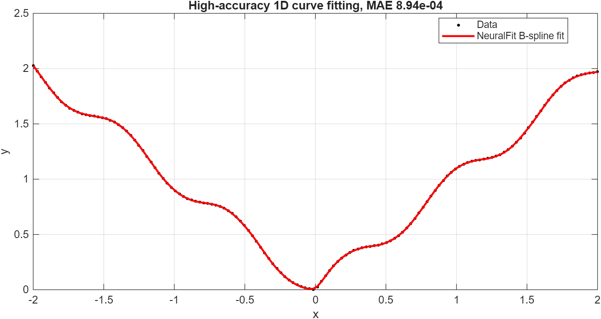
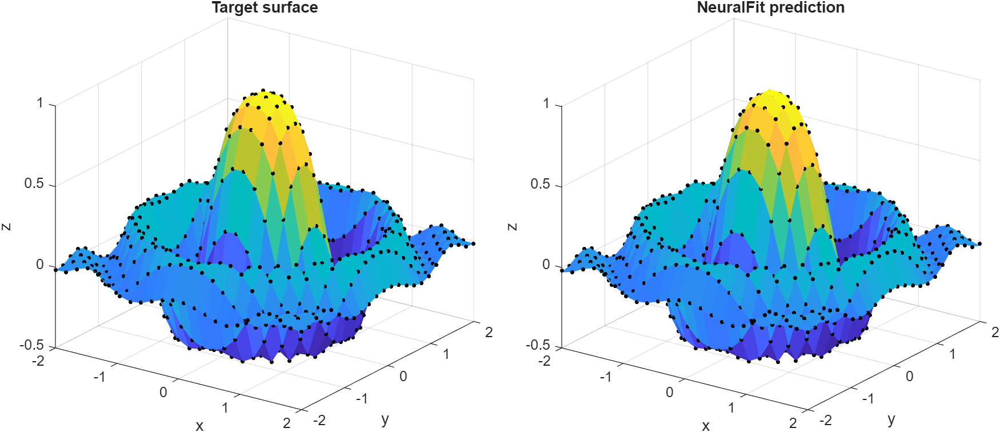
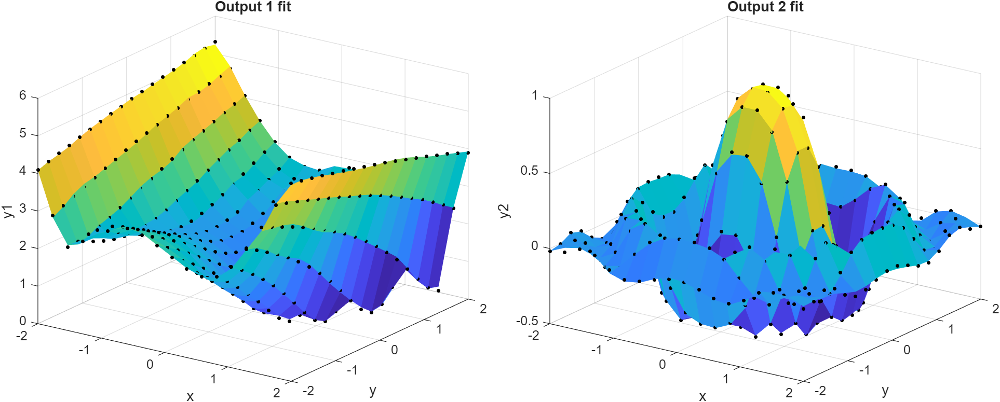

# MATLAB Neural Network Toolbox for High-Accuracy N-D Curve and Surface Fitting

High-precision MATLAB framework for **N-dimensional curve fitting**, **surface fitting**, **multivariable nonlinear regression**, and **function approximation**.

This toolbox is built for MATLAB users who need accurate nonlinear regression without a heavy deep learning stack. It provides a lightweight neural network fitting workflow with learnable B-spline bases, fixed activation bases, ANN/ResNet models, and ADAM + BFGS/LBFGS refinement.

**Search keywords:** MATLAB curve fitting, MATLAB surface fitting, N-dimensional function approximation, nonlinear regression, neural network fitting, multivariable regression, B-spline neural network, high-accuracy surface approximation, BFGS neural network optimizer.

## Fitting Examples

High-accuracy 1D curve fitting with the default learnable B-spline basis:



2D nonlinear surface fitting:



Multi-output 2D surface fitting:



## Core Function

```matlab
NN = NeuralFit(x, y, [N, M]);
```

Where:

- `x` is `N x D`: input dimension by number of samples
- `y` is `M x D`: output dimension by number of samples
- `[N, M]` defines the input and output dimensions

By default, `NeuralFit` uses a learnable quadratic B-spline basis:

```matlab
NN = NeuralFit(x, y, [N, M]);                 % default B-spline basis
NN = NeuralFit(x, y, [N, M], 'basis', 'fixed');    % fixed Gaussian basis
NN = NeuralFit(x, y, [N, M], 'basis', 'Gaussian'); % fixed Gaussian basis
```

Use the default B-spline basis for sharp or nonsmooth data. Use a fixed basis such as Gaussian for smoother targets.

## Key Features

- High-accuracy N-dimensional curve and surface fitting
- Multivariable nonlinear regression with `N x D` input and `M x D` output
- Learnable quadratic B-spline basis for sharp or nonsmooth functions
- Fixed bases such as `Gaussian`, `tanh`, `ReLU`, `Wavelet`, and `Sigmoid`
- Fully customizable network architecture
- ANN and ResNet network types
- First-order and quasi-Newton optimizers
- Lightweight MATLAB implementation with no external dependencies
- Compact demos and live demos for quick onboarding

## Quick Example: 2D Nonlinear Surface Fitting

```matlab
clear; clc; close all;

x = linspace(-2, 2, 20);
y = x;
[X, Y] = meshgrid(x, y);
U = X.^2 + Y.^2;
Z = exp(-0.5*U).*cos(2*U);

data = [X(:), Y(:)].';
label = Z(:).';

NN = NeuralFit(data, label, [2, 1]);
prediction = NN.Evaluate(data);
performanceMetric = NN.Report;

figure();
surf(X, Y, Z); hold on;
scatter3(data(1, :), data(2, :), prediction);
title('2D Surface Fitting');
```

## Installation

Download the package and open the top-level package folder in MATLAB. The top-level MATLAB entry file is intentionally just `mainDemo.m`.

To install the package path, run once:

```matlab
run('installScript/installNeuralNetsPack.m')
```

After installation, `NeuralFit`, `Initialization`, and `OptimizationSolver` work from any MATLAB current folder because the package path is saved.

For future updates, replace the old downloaded package folder with the new one, then run the installer again. The installer retires old or stale NeuralNetsPack / Surface-Fitting-Neural-Networks paths before adding the new package path.

The install scripts are grouped in one folder:

- `installScript/installNeuralNetsPack.m`: one-time installer
- `installScript/setupNeuralNetPath.m`: path setup utility

If you only want to enable the package for the current MATLAB session, run:

```matlab
addpath('installScript')
setupNeuralNetPath(struct('savePath', false))
```

If MATLAB cannot save the path because of permission settings, run MATLAB as usual and run `installScript/installNeuralNetsPack.m` again, or use MATLAB's Set Path tool to save the path manually.

## Manual Network and Solver Setup

For more control, configure the architecture and solver directly:

```matlab
clear; clc; close all;

data = linspace(0, 2*pi, 1000);
label = data.*sin(data) + cos(3*data);

layerStruct = [1, 7, 7, 7, 1];

NN.Cost = 'MSE';
NN.ActivationFunction = 'Gaussian';
NN = Initialization(layerStruct, NN);

option.Solver = 'ADAM';
option.MaxIteration = 200;
option.BatchSize = 100;
NN = OptimizationSolver(data, label, NN, option);

option.Solver = 'BFGS';
option.MaxIteration = 400;
NN = OptimizationSolver(data, label, NN, option);

prediction = NN.Evaluate(data);

figure();
plot(data, label, 'k.', data, prediction, 'r-', 'LineWidth', 1.5);
grid on;
legend('Data', 'Prediction');
```

## Workflow Templates

Ready-to-use script templates are included in `demoScript/`:

- `SimplifiedWorkflow.m`: minimal nonlinear regression workflow
- `CustomizableWorkflow.m`: full control over architecture, solver, and training options
- `BenchmarkSpline1D.m`: short comparison of default B-spline and fixed Gaussian basis
- `SpiralClassification.m`: compact classification example
- `WeightedLeastSquares.m`: weighted fitting example

Short Live Scripts are included in `liveDemo/`:

- `GeneralGuide.mlx`
- `CurveFittingFromNoisyData.mlx`
- `DigitRecognition.mlx`
- `MathModel.mlx`
- `TipsForTrainingNeuralNet.mlx`

The maintainable source files for these Live Scripts are in `liveDemo/source/`.

## Available Optimization Solvers

```matlab
'SGD'
'SGDM'
'RMSprop'
'ADAM'
'AdamW'
'BFGS'
'LBFGS'
```

Typical workflow:

1. Use `ADAM` for a robust first stage.
2. Use `BFGS` or `LBFGS` for high-precision refinement.

## Training Tips

- Keep data shaped as `dimension x samples`.
- Use default `NeuralFit` for sharp or nonsmooth data.
- Use `basis='fixed'` or `basis='Gaussian'` for smoother functions.
- Normalize inputs for better convergence. `NeuralFit` enables autoscaling by default.
- Start with a small network, then increase width/depth only if needed.
- Use BFGS or LBFGS refinement after stochastic training for high precision.

## References

- Nocedal and Wright, *Numerical Optimization*
- Goldfarb et al., practical quasi-Newton methods
- Yi Ren et al., Kronecker-factored quasi-Newton methods
